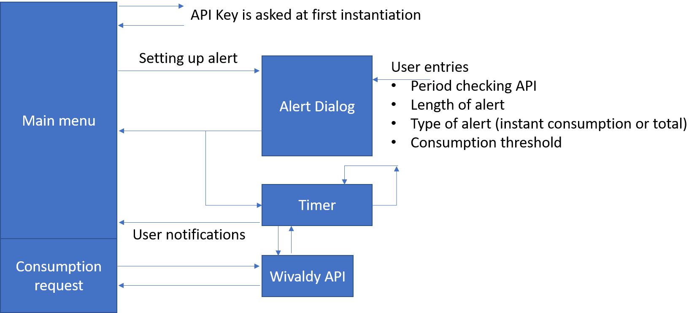
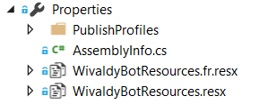

# WivaldyBot
Bot to connect with Wivaldy electricity monitoring service.
This bot allow you to connect to the [Wiwaldy](http://www.wiwaldy.fr) electricy monitoring services. Wivaldy offer non intrusive measurement of your electrical consumption. They allow you to see how you are consumming to optimize your consumption. This service targets both consumer and enterprises. 
Wivaldy is currently a startup and they are locarted at Station F.

# Wivaldy API
Wivaldy offers a set of API to consume their services. So far, the set of API is limited but extentions are forecasted soon.
The API require a unique key which is used for authentication and access your consuption.

## Functions
3 functions are supported so far. All calls are HTTPS GET calls. HTTP is not supported. 

**https://app.wivaldy.com/api/v1/json/PRIVATE_KEY/2016-11-01-08:00/2016-11-01-08:10**

Get request to get the consumption from a specific time of a day to another specific time of the day.
Multiple elements are returned.

**https://app.wivaldy.com/api/v1/json/PRIVATE_KEY/2017-01-02/2017-01-04**

Get request to get the consumption from a specific day to another specific day. If current day is the last day, all data for the current day will be returned.
Multiple elements are returned.

**https://app.wivaldy.com/api/v1/json/PRIVATE_KEY/last**

Get request to get the instant last consumption. 
In this case only 1 element is returned. 

## Parameters
**PRIVATE_KEY**

The private key is required to get any data. The format of the key is: 12345678-9abc-def0-1234-56789abcdef0

It is planned to have an authentication using a login a password on the Wivaldy website and have the key passed to the bot during this process in a futur version of the API.

**Date format**

Date format must be Year-month-day-hour:minutes
* year: coded into 4 digits
* month: coded into 2 digits
* day: coded into 2 digits
* hour: coded into 2 digits on a 24h format
* minutes: coded into 2 digits

Example: 4th of May 2017 at 13:15 (so 1:15 PM) will be coded the following way: 2017-05-04-13:15

## Returned objects
Returned objects are JSON. It's a collection of Consumption objects whichg are a simple pair of int like this: 

*{ "epoch":1234, "watts":1234 }*

The epoch element is an epoch standard Unix time in seconds.

The object code in C# is the following:
```C#
public class Electricity
{
    public Consumption[] Consumptions { get; set; }
}

public class Consumption
{
    public int epoch { get; set; }
    public int watts { get; set; }
}
```

## Calling the API
The API call is quite straight forward. The example in this bot allow to call the 3 API functions from a main function as well as proposing specific function. The API is call filling the PRIVATE_KEY in the URL as well as the dates. Depending on the start and stop DateTimeOffset objects.
Once the API called, the returned string contains either a collection, in this case, it will start with a '[', either '{' and it's a single elements, either nothing or something else and it is an error.
In case we have a collection, we're just rederializing it in a List, in case of a single object, same and creating a List with only 1 element. In case of nothing or an error, the exception is trap and a null collection is returned. 

```C#
public async Task<Electricity> GetMeasures(DateTimeOffset start, DateTimeOffset stop)
{
    // Connection is a string containing the PRIVATE_KEY
    try
    {
        HttpClient cli = new HttpClient();
        string urlrequest = $"https://app.wivaldy.com/api/v1/json/{Connection}/";
        //if both are null, then only last measure
        if ((start == DateTimeOffset.MinValue) && (stop == DateTimeOffset.MinValue))
            urlrequest += "last";
        //if only stop is nullm than a full day
        else if (stop == DateTimeOffset.MinValue)
            urlrequest += start.ToString("yyyy-MM-dd") + "/" + start.AddDays(1).ToString("yyyy-MM-dd");
        else
        {
            //TEMP FIX TO REMOVE WHILE NO DATA
            //start = start.AddDays(-8);
            //stop = stop.AddDays(-8);
            // END REMOVE
            if (DateTimeOffset.Compare(start, stop) > 1)
            { stop = start.AddDays(1); }
            urlrequest += start.ToString("yyyy-MM-dd-HH:mm") + "/" + stop.ToString("yyyy-MM-dd-HH:mm");
        }
        var str = await cli.GetStringAsync(new Uri(urlrequest));
        Electricity elec = new Electricity();
        if (str.Contains("["))
        {
            var measuregroup = JsonConvert.DeserializeObject<List<Consumption>>(str);                  
            elec.Consumptions = measuregroup.ToArray();                    
        }
        else
        {
            var measure = JsonConvert.DeserializeObject<Consumption>(str);
            elec.Consumptions = new Consumption[1];
            elec.Consumptions[0] = measure;
        }
        return elec;
    }
    catch (Exception ex)
    {
        Debug.WriteLine($"exception: {ex.Message}");
    }
    return null;
} 
```

## Calculating the consumption in Watt hour (Wh)
So far in this version of API, only the raw data are returned. In the coming v2, you'll be able to directly the Wh or kWh.
In order to compute it, it is necessary to make the math. The algorythm is quite simple as we can assume that the sensor send data only when the consumption is changing.
We have then a discrete set of data, all horrodated with a date time, in this case the Unix epoch. The epoch Unix is second based. The Wh is the number of watt consummed in 1 hour. So to make this, every measure will then be calculated by multiplying the watt by the difference of seconds between the previous measure and the current one. And the results will be added. We will then have a whatt second measure. The final result will then be divided by 3600 to get the measure in hour.
You'll note if you look at the function that 1 element is not took into consideration for the math as it does require to have a start and a stop, so at least 2 measures. The sensor approximation and the way the math is done gives quite accurate results compare to the real measurement. 
Keep in mind that whatever sensor you'll use, the real consumption will never be extremly precise. It's what's happening as well in your electrical counter. 

# The bot
The Bot is working using the following logic:



The main menu is always looping after an information has been sent to the user. It does allow an easy and simple finger navigation without having to type anything. It has the inconvenient that on small screens, the user may have to scroll up a bit to see the results.

## Main menu
The main menu is working with cards, having a picture and few choices. The navigation is quite straight forward. the logic is explained in the BrickBot bot. See [BrickBot](https://github.com/ellerbach/brickbot) for more information.

Note that in case of error the main menu is called again. And if at some point, it is in an unknown stage, when the user will type anything, the menu will be bring back again.

## Alert dialog
This dialog uses the user input to setup an alert. The dialog ask the information in a linear way with a simple retry in case of failure. The error message does adapt depending on the error. I've already describe this principle and the number of max retry in the currency bot. See [CurrencyBot](https://github.com/ellerbach/currencybot) for more information.

## Internationalization
The bot currently suports French and English. It is managed thru resrouce files. Those resource files need to have the same main name with '.' and then the local name.



The call on the right resource file is then automatic based on the client local. The generated classes can be called directly.
If you need to force a specific local, you can use the ResourceManager.GetString function to return a string. It takes the resource string as argument and the local. It's the reason the information regarding the user are stored with the local for the proactive notifications.


## Managing proactive notifications

The fundamentals to send notifications to the user is explained [here](https://docs.microsoft.com/en-us/bot-framework/dotnet/bot-builder-dotnet-proactive-messages)
In order to work, you basically need a Timer in the main dialog, this Timer will raise a function. In our case, we want this timer to check the API and then have it called again.
This makes a differnce vs a difference vs the existing example where the timer is called only once.

Here is the scenario:
* the user setup a periodic check every 60 seconds, for 2 hours
* after 10 minutes, he decides to setup another time to replace the previous one every 30 seconds for 1 hour
* the bot should be able to find the previous timer and kill it so the new timer can run

Timer are not serialized as they need to run even if the user context and information is serialized.

this does imply to store the timer hashcode on a static list for a specific user to be able to compare the timer hascodes and kill the one which needs to be killed when the callback function is called.

In the simple example used to rasied the notification to the user, a specific Controller has been created. This controller has static functions which are called to send the notification. Every single user can be identify uniquely by the channel Id and the Conversation Id. So I'll use a static dictionnary with the key as the channel Id and conversation Id and the data with the last timer hascode.

Once the timer function is called, I'm chekcing if the hascode of the timer is the same as the one store. If not, then it means it's an old timer which needs to be killed.

```C#
//part of the static controller 
public static Dictionary<string, int> Timers = new Dictionary<string, int>();

// part of the main dialog, variable at the class level
[NonSerialized]
Timer tAlert;

// part of main dialog, in a function called afte the alert dialog is closed
// this setup the timer
StartAlert = DateTimeOffset.Now;
tAlert = new Timer(new TimerCallback(TimerEventAsync));
tAlert.Change((int)alert.Interval.TotalMilliseconds, (int)alert.Interval.TotalMilliseconds);
NumberAlerts = 0;
// this store the timer hascode i the dictionnary 
try
{
    var ret = ConversationStarter.Timers[context.Activity.Conversation.Id + context.Activity.ChannelId];
    ConversationStarter.Timers[context.Activity.Conversation.Id + context.Activity.ChannelId] = tAlert.GetHashCode();
}
catch (Exception)
{
    ConversationStarter.Timers.Add(context.Activity.Conversation.Id + context.Activity.ChannelId, tAlert.GetHashCode());
}


// part of the main dialog, the call back timer function
private void TimerEventAsync(object target)
{
    //remove previously created timers
    var ret = ConversationStarter.Timers[me.conversationId + me.channelId];
    if (ret != tAlert.GetHashCode())
    {
        tAlert.Dispose();
        return;
    }

    if (StartAlert.Add(alert.MaxTime) <= DateTimeOffset.Now)
    {
        tAlert.Dispose();
        ConversationStarter.EndAlerts(me.conversationId, me.channelId);
    }
    if (NumberAlerts > AlertMaxNumber)
    {
        tAlert.Dispose();
        ConversationStarter.EndAlertsMax(me.conversationId, me.channelId);
    }
    //...
    //code continues
    //...
}
```
Note that if you reploy a new version of the bot, you'll loose the static dictionnary for all users. So all users who have setup an alert and setup another alert will experience a double alert. To avoid this, the dictionnary should be stored into a table for example.

As you'll see as well in the code, the users are store in a List as well. Same as for the notifications, this may generate issues for existing notifications. Same, best would be to store into a table when a new user is added and load the table when the class is inialized.